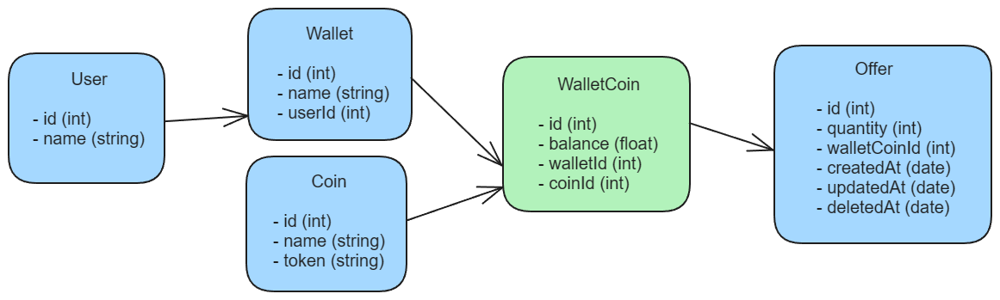

<br/>
<p align="center">
  <h3 align="center">Web Wallet</h3>

  <p align="center">
    <a href="https://github.com/caiofsr/web-wallet#Endpoints"><strong>Veja a documentação »</strong></a>
    <br/>
    <br/>
  </p>
</p>


## Sumário

- [Sumário](#sumário)
- [Feito com](#feito-com)
  - [Modelagem de dados](#modelagem-de-dados)
- [Passos iniciais](#passos-iniciais)
  - [Pre-requisitos](#pre-requisitos)
  - [Instalação](#instalação)
- [Endpoints](#endpoints)
- [Autor](#autor)
- [Melhorias futuras](#melhorias-futuras)

## Feito com

Esse projeto foi feito com Node.js, NestJS, prisma e postgres. Utilizando da Arquitetura Limpa as pastas de `src` representam algumas camadas utilizadas nesse projeto.

### Modelagem de dados


## Passos iniciais

Para rodar o projeto localmente siga os próximos passos.

### Pre-requisitos

* npm

```sh
npm install npm@latest -g
```

* docker-compose (opcional)
Você pode usar uma instância do postgres já instalada no seu computador, só alterar as credencias nos arquivos locais.

### Instalação

1. Instale os pacotes do npm

```sh
npm install
```

2. Altere as variáveis de ambiente no arquivo `.env`. OBS: `DATABASE_URL` é o mais importante pois o prisma utiliza. As variáveis que começam com `DB_` são utilizada para criação da instância no docker com o docker-compose.
```ENV
DB_USER=
DB_PASSWORD=
DB_NAME=
PORT=
DATABASE_URL=
```

3. Inicie o banco de dados com docker-compose
```sh
docker-compose up -d
```

4. Execute as migrations pelo prisma
```sh
npx prisma migrate dev
```

5. Após as migrations execute o seed do banco de dados
```sh
npx prisma db seed
```

6. Por fim inicie o servidor da API

```sh
npm run start:dev
```

7. Para rodar os testes
  ```sh
  npm run test
  ```

## Endpoints

* `[POST]` - http://localhost:{your_port}/offers?userId={user_id}
  * Acceptance body
  ```json
  {
    "quantity": integer,
    "walletCoinId": integer
  }
  ```
* `[GET]` - http://localhost:{your_port}/offers?page={current_page}&limit={limit_offers_per_page}

* `[DELETE]` http://localhost:{your_port}/offers/{offer_id}?userId={user_id}


## Autor

* **Caio Fernando** - *Software Engineer* - [Github](https://github.com/caiofsr)

## Melhorias futuras

* Aperfeiçoar o sistema para lidar de forma melhorada nome e o token das moedas no endpoint de listagem das ofertas.
* "Dockerizar" a aplicação inteira para eventuais escalonamentos com Kubernetes.
* Esclarecer a mensagem de erro do validator do endpoint de criar ofertas.
* Otimização das queries com adição de index em campos importantes
* Trocar a geração de id de sequencial para uuid
* Adicionar logging e telemetria
* Adicionar um servidor de Swagger para demonstração dos endpoints
